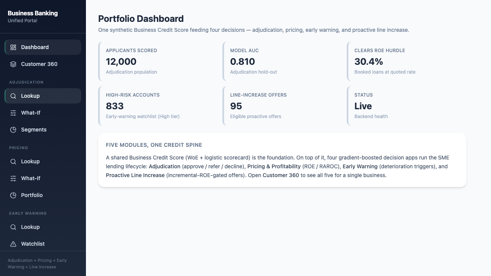
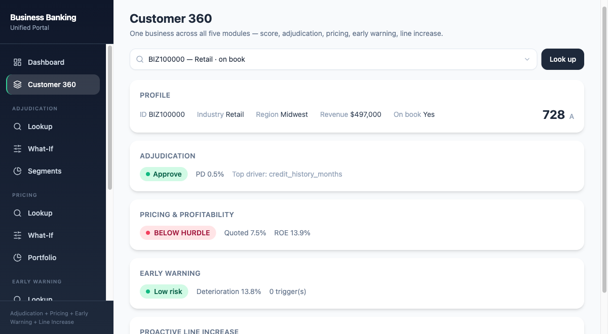

# Business Banking App — built with Claude Code

A working prototype of an end-to-end **SME (small & medium business) lending platform**: one
shared credit score feeding four decision apps, wrapped in a single React portal over a FastAPI
backend. Built spec-first, module-by-module, and verified at every step.

> ⚠️ **Fully synthetic data.** Every business, account, and behavioral record is generated by
> `shared/data_generator.py`. There is **no internal, proprietary, or customer data** anywhere in
> this repository. The models and numbers exist to demonstrate the engineering, not to make real
> lending decisions.

<p align="center">
  
  
</p>

---

## What it does

A shared **Business Credit Score** (WoE + logistic scorecard) is the spine. On top of it, four
gradient-boosted decision apps run the SME lending lifecycle, and an integrated portal ties them
together with a portfolio Dashboard and a single-customer 360 view.

```
                         ┌──────────────────────────────┐
                         │   Business Credit Score       │   WoE + Logistic scorecard
                         │   AUC 0.818 · KS 0.495        │   (shared foundation)
                         └──────────────┬───────────────┘
            ┌───────────────┬───────────┼───────────────┬───────────────┐
            ▼               ▼                           ▼               ▼
     Adjudication      Pricing &                  Early Warning     Proactive
     Approve/Refer/    Profitability              deterioration     Line Increase
     Decline           ROE / RAROC                triggers          incremental-ROE
            └───────────────┴───────────┬───────────────┴───────────────┘
                                        ▼
                    Unified Portal — Dashboard + Customer 360
```

## The five modules

| Module | What it does | Headline metrics |
|--------|--------------|------------------|
| **0 · Business Credit Score** | WoE binning + logistic scorecard, scaled 300–850 with reason codes | AUC **0.818**, KS **0.495** |
| **1 · Adjudication** | LightGBM PD model + policy layer (DSCR/leverage/delinquency knockouts) → Approve / Refer / Decline with SHAP reason codes | AUC **0.810**, top-20% lift **2.86×** |
| **2 · Pricing & Profitability** | Expected-loss pricing + ROE/RAROC waterfall, mispricing detection vs a 15% ROE hurdle | only **30.4%** of booked loans clear the hurdle at quoted rate |
| **3 · Early Warning** | Behavioral-panel deterioration model + trigger flags + risk-tier watchlist | top-decile capture **2.16×**, PR-AUC **0.308** |
| **4 · Proactive Line Increase** | Candidate model + amount rules + incremental-ROE gate with a risk-appetite PD ceiling | AUC **0.813**; offered cohort PD **0.036** vs book **0.117**; aggregate incremental ROE **0.215** |
| **Portal Integration** | Cross-module Dashboard, **Customer 360** (all five modules for one business via `GET /api/customer/{id}`), dropdown lookups, HTML demo deck | 104 backend tests · 14 e2e |

Synthetic dataset: **12,000 businesses** (8,336 booked accounts), a **24-month / 200,064-row**
behavioral panel.

## Tech stack

- **Backend:** Python 3.13, FastAPI, pandas, LightGBM, SHAP, scikit-learn. Served by `uvicorn`.
- **Frontend:** React + Vite + Tailwind (a Vite-direct portal that proxies `/api` to FastAPI — no
  Express server).
- **Tests:** pytest (backend, 104) + Playwright (end-to-end, 14, with screenshot capture).
- Self-contained virtualenv at `./.venv`. Ports: FastAPI **8100**, Vite **5180**.

## Quickstart

```bash
# 1) Python deps
python3 -m venv .venv
./.venv/bin/pip install -r requirements.txt

# 2) Generate synthetic data + train models (gitignored artifacts; deterministic & seeded)
./.venv/bin/python -m shared.data_generator     # → shared/data/raw/*.parquet
./.venv/bin/python -m score.src.train           # shared credit scorecard
./.venv/bin/python -m adjudication.src.train
./.venv/bin/python -m ews.src.train
./.venv/bin/python -m line_increase.src.train
# (Pricing is a pure analytical engine — no trained model.)

# 3) Run the backend (loads artifacts, ~30s) — from the repo root
./.venv/bin/uvicorn portal.server.main:app --port 8100

# 4) Run the frontend (separate shell)
cd portal/client && npm install && npm run dev   # → http://localhost:5180
```

Open **http://localhost:5180**. Use the **Customer 360** tab to see one business across all five
modules; each module also has its own Lookup / What-If / Segments views with example-business
dropdowns.

## Testing

```bash
./.venv/bin/pytest -q                     # backend (expect 104 passed)
cd portal/client && npx playwright test   # e2e (expect 14; auto-starts both servers)
```

Playwright writes step screenshots to `docs/screenshots/e2e/` (kept for demos/teaching).

## Key API endpoints

| Endpoint | Purpose |
|----------|---------|
| `GET /api/dashboard/summary` | Cross-module portfolio KPIs |
| `GET /api/customer/{id}` | 360 view — all five modules for one business |
| `GET /api/examples` | Diverse example business IDs + hints (powers the lookup dropdowns) |
| `GET /api/adjudication/{id}`, `.../segments`, `POST .../decide` | Adjudication |
| `GET /api/pricing/{id}`, `.../portfolio`, `POST .../quote` | Pricing |
| `GET /api/ews/{id}`, `.../watchlist`, `.../segments` | Early Warning |
| `GET /api/line-increase/{id}`, `.../candidates`, `POST .../simulate` | Line Increase |

## Project structure

```
score/  adjudication/  pricing/  ews/  line_increase/   # per-module src/ + models/ + tests/
shared/         # config, synthetic data_generator, shared data
portal/
  server/       # FastAPI app, per-module services, schemas, tests
  client/       # React + Vite portal, e2e specs
docs/
  superpowers/specs/   # design specs (one per module)
  superpowers/plans/   # implementation plans
  deck/index.html      # self-contained HTML demo deck
  screenshots/         # e2e + dropdown + deck screenshots
program_state.json     # build ledger (source of truth for progress)
SESSION_LOG.md         # narrative session log
```

## How it was built — plan → execute → verify

This project was built with **Claude Code** as a multi-session, spec-first program. Each module
followed the same disciplined cycle: **brainstorm → design spec → implementation plan →
subagent-driven build** (a fresh implementer per task, with two-stage spec-compliance + code-quality
review), gated by real metric thresholds and a green test suite before any merge.

A self-contained walkthrough deck lives at [`docs/deck/index.html`](docs/deck/index.html) (open it
in a browser; arrow keys to navigate). The standout governance moment: on two modules the synthetic
target was mathematically noise-capped, and the build agents **escalated rather than gaming an
unreachable metric gate** — resolved by an explicit human decision and documented, not silently
weakened.

Progress is tracked in `program_state.json` (ledger) and `SESSION_LOG.md` (narrative).

## License & disclaimer

Prototype / demonstration code on **synthetic data only**. Not a production lending system and not
suitable for real credit decisions. No warranty.
